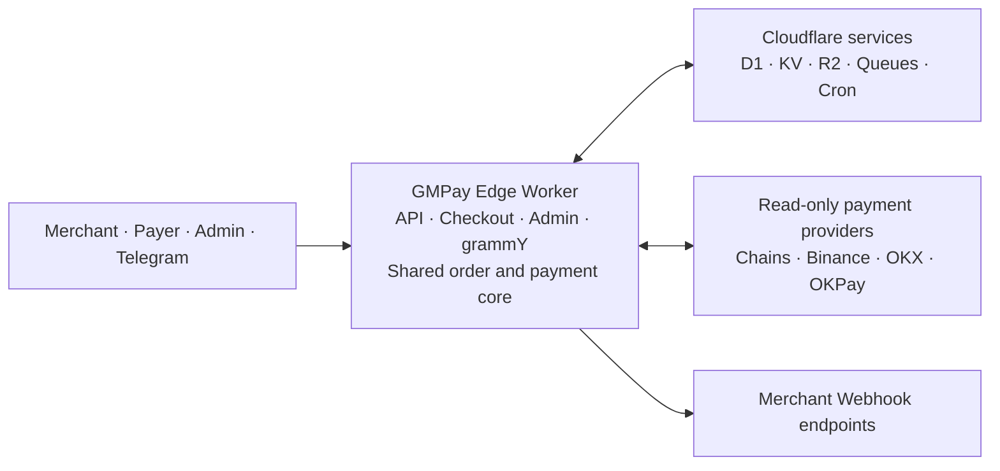

# GMPay Edge

**Multi-chain payments, built for the edge.**

[简体中文](README.zh-CN.md) · English

[](LICENSE)
[](https://workers.cloudflare.com/)
[](https://bun.sh/)
[](https://www.typescriptlang.org/)
[](https://react.dev/)
[](https://tanstack.com/start)
[](https://developers.cloudflare.com/d1/)
[](https://www.better-auth.com/)
[](https://vitest.dev/)
[](project.inlang/settings.json)

GMPay Edge is a self-hosted, single-tenant cryptocurrency payment gateway for
Cloudflare Workers. One deployment provides signed merchant APIs, a responsive
checkout, payment operations, dynamic role-based access control, durable
Webhook delivery, scheduled processing, and Telegram automation.

It is designed for operators who want to retain control of their payment
infrastructure while using read-only chain, exchange, and wallet integrations.
Merchants are external API clients; operators and administrators work through
the protected `/admin` application.

> [!IMPORTANT]
> GMPay Edge is under active development. A built-in integration means the
> capability is implemented; it does not mean that the method is automatically
> production-ready or exposed at checkout. Production use requires
> deployer-owned endpoints or read-only credentials, configured receiving
> methods, backups, monitoring, and real-platform acceptance tests.

## Core capabilities

- Receive payments through TRON, EVM networks, TON, Aptos, and Solana.
- Detect inbound payments through read-only Binance, OKX, and OKPay adapters.
- Expose the signed GMPay merchant protocol with JSON and form input.
- Support EPay at the API boundary without maintaining a second order model.
- Preserve immutable payment snapshots and process order state transitions and
  payment accounting centrally and idempotently.
- Deliver merchant callbacks through a durable Queue-backed outbox with retry
  history, manual retry, and audit records.
- Protect administration with Better Auth, TOTP, and dynamic multi-role RBAC,
  including a protected built-in `root` role.
- Run payment scanning, expiry, cleanup, connection health, and rate sync through
  Cloudflare Queues and Cron Triggers.
- Operate Telegram Bots through grammY with Inline orders, public commands,
  localized templates, user bindings, and notification subscriptions.
- Provide a responsive React 19 admin console, checkout, public status pages,
  OpenAPI reference, and six UI locales.

## Supported payment integrations

| Type | Integration | Built-in assets |
| --- | --- | --- |
| On-chain | TRON / TRC20 | USDT, TRX |
| On-chain | Ethereum / ERC20 | USDT, USDC, ETH |
| On-chain | Base | USDT, USDC, ETH |
| On-chain | BNB Smart Chain / BEP20 | USDT, USDC, BNB |
| On-chain | Polygon | USDT, USDC, MATIC |
| On-chain | TON | USDT, GRAM |
| On-chain | Aptos | USDT, USDC |
| On-chain | Solana | USDT, USDC |
| Exchange | Binance | USDT, USDC |
| Exchange | OKX | USDT, USDC |
| Wallet | OKPay | USDT, TRX |

Payment methods form the built-in capability catalog. Checkout exposure is
controlled separately by ready receiving methods. A receiving method must have
the required public connection or read-only account configuration and pass its
availability checks before it can be offered to a payer.

See [Payment methods and receiving methods](docs/en-US/PAYMENT_METHODS.md) for
provider requirements, limits, retry behavior, and the production checklist.

## Architecture



One Worker owns every product surface and the shared order and payment core. D1
is authoritative; KV provides validated versioned caches and R2 stores private
artifacts. Cron and Queues move payment scans and Webhook retries outside
synchronous requests. Payment adapters remain read-only.

## Quick start

### Requirements

- [Bun](https://bun.sh/) 1.3 or later
- A local environment supported by [Wrangler](https://developers.cloudflare.com/workers/wrangler/)

Install dependencies and start the development server:

```bash
bun install
bun run dev
```

`bun run dev` applies pending migrations to the local `gmpay-edge` D1 database
and starts the application at <http://localhost:3000>. Local development uses
Wrangler-managed local bindings; it does not apply migrations to remote D1.

Open <http://localhost:3000/install> on the first run. Installation creates the
first user, the protected `root` role, runtime secrets, payment defaults, four
public Telegram commands, five public templates with six locale translations,
and Telegram defaults. The current Origin is stored as the application URL and
an Allowed Host, then the new root user is signed in automatically. Installation
does not create a Telegram Bot or call Telegram.

After installation:

1. Review the generated system settings in `/admin`.
2. Confirm the detected HTTPS origin and back up the runtime configuration.
3. Configure and test the required public connections or read-only credentials.
4. Create receiving methods for the assets that should appear at checkout.
5. Create a scoped merchant API credential and complete a signed test order.

## Deploy to Cloudflare Workers

GMPay Edge deploys as one Cloudflare Worker with D1, KV, private R2, two Queues,
and Cron Triggers. Complete the [deployment checklist](docs/en-US/DEPLOYMENT.md)
before accepting production payments.

### Deploy button

[](https://deploy.workers.cloudflare.com/?url=https://github.com/GMWalletApp/gmpay-edge)

The guided flow requires a public source repository. It provisions the bindings
declared in `wrangler.jsonc`, applies D1 migrations, and builds the Worker. Use
`bun run build` as the Build command and `wrangler deploy` as the Deploy command.
When deployment finishes, open `/install` on the Worker URL to initialize the
instance.

### Wrangler CLI

Authenticate Wrangler and run the package deployment command:

```bash
bun install
bunx wrangler login
bun run deploy
```

If D1 must be prepared manually, run `bunx wrangler d1 create gmpay-edge`
followed by `bun run db:migrate:remote`. Do not commit the generated database ID.

The `predeploy` hook creates or reuses the named D1, R2, and Queue resources,
applies the D1 baseline through `DB`, and builds the Worker before publication.
The build script never writes account-specific IDs or temporary values to
`wrangler.jsonc`.

The deployment declares these bindings:

| Binding | Cloudflare product | Purpose |
| --- | --- | --- |
| `DB` | D1 | Authoritative application, payment, authorization, and delivery data |
| `CACHE` | KV | Short-lived validated caches and ancillary telemetry |
| `FILES` | R2 | Private payment-review evidence and generated exports |
| `PAYMENT_QUEUE` | Queues | Asynchronous payment scanning |
| `WEBHOOK_QUEUE` | Queues | Asynchronous merchant Webhook delivery |

## Merchant integration

GMPay is the primary merchant protocol. EPay is a compatibility adapter over the
same order service, idempotency rules, state machine, checkout, query behavior,
and callback pipeline.

### Create an order

```text
POST /payments/gmpay/v1/order/create-transaction
```

The endpoint accepts JSON or form data. A request includes the numeric credential
`pid` and a lowercase MD5 signature calculated from sorted, non-empty parameters
plus the credential Secret. Supplying an existing `order_id` never creates a
second order. Omitting both `token` and `network` creates a selectable order;
GMPay Edge does not silently default it to TRON.

### Query an order

```text
GET /payments/gmpay/v1/order/query
```

Provide exactly one `trade_id` or `order_id` and sign the request with the same
credential. A credential can query only orders it created.

### Receive callbacks

The merchant supplies `notify_url` when creating an order. Callback destinations
must pass the instance SSRF and security policy. Committed order events are
delivered asynchronously with deterministic signatures, retained attempts,
bounded retries, and an audited manual retry path. Handlers should verify the
signature, process duplicate events idempotently, and acknowledge only after
committing their local state.

Use the runtime `/docs` page or the tracked
[OpenAPI contract](public/openapi.yaml) for the authoritative fields and status
values. Signing vectors, callback parameters, error codes, and EPay routes are
documented in the [Merchant API guide](docs/en-US/MERCHANT_API.md).

## Technology stack

| Area | Technology |
| --- | --- |
| Runtime | Cloudflare Workers |
| Application | React 19, TanStack Start/Router/Query/Table/Form |
| UI | Tailwind CSS 4, shadcn/Radix |
| Authentication | Better Auth |
| Authorization | Project-owned dynamic RBAC with permission bit masks |
| Data | Cloudflare D1, Drizzle ORM |
| Edge services | KV, R2, Queues, Cron Triggers |
| Telegram | grammY, Telegram Bot API |
| Internationalization | ParaglideJS |
| Tooling | Bun, strict TypeScript, Vitest, Biome, Wrangler |

## Development and quality

Common development commands:

```bash
bun run dev
bun run db:migrate:local
bun run generate-routes
bun run typecheck
bun run test
bun run check
bun run build
```

Use `bun run db:generate` only for an intentional Drizzle schema change and
review the generated migration. `src/paraglide` is generated by the Vite
Paraglide plugin and ignored; it does not need to be committed.

Before submitting a completed change, run the final quality gate on the same
working tree:

```bash
bun run typecheck
bun run test
bun run check
bun run build
```

Tests are organized under `tests/unit`, `tests/integration`, `tests/security`,
and `tests/e2e`. Deterministic fixtures prove application behavior, but retained
live-provider suites are intentionally skipped and must be run manually with
deployer-owned infrastructure during production acceptance.

## Documentation

| Topic | Documentation |
| --- | --- |
| Deployment and production sign-off | [Deployment checklist](docs/en-US/DEPLOYMENT.md) |
| Cloudflare free-tier capacity and optimization | [Free-tier audit](docs/en-US/CLOUDFLARE_FREE_TIER.md) |
| Merchant requests, signatures, errors, and EPay | [Merchant API](docs/en-US/MERCHANT_API.md) |
| Provider configuration and receiving methods | [Payment methods](docs/en-US/PAYMENT_METHODS.md) |
| Inbound endpoints and merchant delivery | [Webhooks](docs/en-US/WEBHOOKS.md) |
| Bots, Inline orders, templates, and notifications | [Telegram](docs/en-US/TELEGRAM.md) |
| Authentication, secrets, uploads, and response policy | [Security notes](docs/en-US/SECURITY.md) |
| Implemented capabilities and required evidence | [Capability matrix](docs/en-US/CAPABILITY_MATRIX.md) |
| Machine-readable API contract | [OpenAPI YAML](public/openapi.yaml) |
| Runtime API reference | `/docs` on a running instance |

## Security

- Never commit `.dev.vars`, Bot tokens, API Secrets, private keys, seed phrases,
  exchange secrets, or Cloudflare credentials.
- GMPay Edge never stores withdrawal authority, wallet private keys, or seed
  phrases. Exchange and wallet integrations must use the minimum read-only
  permissions required for payment detection.
- API credential Secrets, receiving-method credentials, and Telegram Bot tokens
  are encrypted before storage with their configured application encryption
  keys. They are revealed only at creation or rotation and resolved server-side
  when required.
- Runtime settings are stored in D1. Runtime secret values are returned only to
  administrators with `settings:read`, rendered in password fields, and
  preserved when an update submits an empty value.
- Better Auth owns passwords, sessions, and TOTP. Configure Allowed Hosts, HTTPS,
  Origin and CSRF validation, rate limits, administrator recovery procedures,
  and recovery-code acknowledgement before production use.
- Back up D1 and the runtime configuration before upgrades. Replacing
  `runtime.better_auth_secret` invalidates existing authentication material.
- Callback destinations, provider responses, uploads, Queue messages, and KV
  values are untrusted boundaries. Production acceptance must include SSRF,
  signature, permission-path, retry, duplicate-event, and recovery checks.

Read the [security notes](docs/en-US/SECURITY.md) and the security sections of
the deployment checklist before exposing an instance publicly.

## Acknowledgements and license

Product research referenced [GMWalletApp/epusdt](https://github.com/GMWalletApp/epusdt).
Its protocol and internal data model are not copied into GMPay Edge unless
explicitly documented as a boundary adapter.

GMPay Edge is licensed under [GPL-3.0-or-later](LICENSE).
