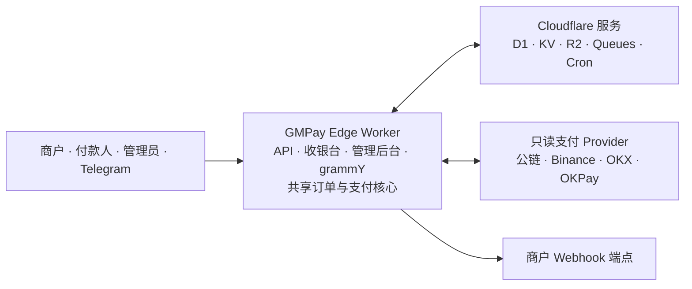

# GMPay Edge

**为边缘网络而生的多链支付网关**

简体中文 · [English](README.md)

[](LICENSE)
[](https://workers.cloudflare.com/)
[](https://bun.sh/)
[](https://www.typescriptlang.org/)
[](https://react.dev/)
[](https://tanstack.com/start)
[](https://developers.cloudflare.com/d1/)
[](https://www.better-auth.com/)
[](https://vitest.dev/)
[](project.inlang/settings.json)

GMPay Edge 是面向 Cloudflare Workers 的自托管单租户加密货币支付网关。一个部署即可提供带签名的商户 API、响应式收银台、支付运营、动态角色权限、可靠的 Webhook 投递、定时处理和 Telegram 自动化。

它适合希望掌控支付基础设施，同时通过只读方式接入公链、交易所和数字钱包的运营者。商户是外部 API 客户端；运营人员与管理员统一使用受保护的 `/admin` 后台。

> [!IMPORTANT]
> GMPay Edge 仍在持续开发。内置接入表示相应能力已经实现，不代表该方式会自动达到生产可用状态或出现在收银台。生产使用仍需要部署者自己的端点或只读凭证、配置完成的收款方式、备份与监控，以及真实平台验收测试。

## 核心能力

- 通过 TRON、EVM 网络、TON、Aptos 和 Solana 接收付款。
- 通过 Binance、OKX 与 OKPay 只读适配器检测入账。
- 提供 GMPay 主商户协议，支持 JSON 与表单输入。
- 在 API 边界兼容 EPay，不维护第二套订单模型。
- 保留不可变支付快照，集中且幂等地处理订单状态流转与支付入账。
- 通过 Queue 支持的可靠 Outbox 投递商户回调，并保留重试历史、人工重试和审计记录。
- 使用 Better Auth、TOTP 和动态多角色 RBAC 保护后台，包括受保护的内置 `root` 角色。
- 通过 Cloudflare Queues 与 Cron Triggers 执行支付扫描、过期处理、清理、连接健康检查和汇率同步。
- 使用 grammY 管理 Telegram Bot，支持 Inline 下单、公共指令、本地化模板、用户绑定和通知订阅。
- 提供 React 19 响应式后台、收银台、公共状态页、OpenAPI 文档和六语言界面。

## 支持的支付接入

| 类型 | 接入 | 内置资产 |
| --- | --- | --- |
| 链上网络 | TRON / TRC20 | USDT、TRX |
| 链上网络 | Ethereum / ERC20 | USDT、USDC、ETH |
| 链上网络 | Base | USDT、USDC、ETH |
| 链上网络 | BNB Smart Chain / BEP20 | USDT、USDC、BNB |
| 链上网络 | Polygon | USDT、USDC、MATIC |
| 链上网络 | TON | USDT、GRAM |
| 链上网络 | Aptos | USDT、USDC |
| 链上网络 | Solana | USDT、USDC |
| 交易所 | Binance | USDT、USDC |
| 交易所 | OKX | USDT、USDC |
| 数字钱包 | OKPay | USDT、TRX |

支付方式构成内置能力目录，收银台是否展示由可用的收款方式独立控制。收款方式必须配置所需的公共连接或只读账户信息并通过可用性检查，才能提供给付款人选择。

Provider 要求、限制、重试行为和生产检查清单参见[支付方式与收款方式](docs/zh-CN/PAYMENT_METHODS.md)。

## 系统架构



一个 Worker 承载全部产品入口以及共享的订单与支付核心。D1 是权威数据源；KV 提供经过校验且带版本的缓存，R2 保存私有文件。Cron 与 Queues 将支付扫描和 Webhook 重试移出同步请求，支付适配器始终保持只读。

## 快速开始

### 环境要求

- [Bun](https://bun.sh/) 1.3 或更高版本
- [Wrangler](https://developers.cloudflare.com/workers/wrangler/) 支持的本地运行环境

安装依赖并启动开发服务器：

```bash
bun install
bun run dev
```

`bun run dev` 会将待执行的 migration 应用到本地 `gmpay-edge` D1 数据库，并在 <http://localhost:3000> 启动应用。本地开发使用 Wrangler 管理的本地绑定，不会对远程 D1 执行 migration。

首次运行访问 <http://localhost:3000/install>。安装会创建首位用户、受保护的 `root` 角色、运行密钥、支付默认数据、4 条公共 Telegram 指令、5 个覆盖 6 种语言的公共模板和 Telegram 默认设置，并将当前 Origin 写入应用地址和 Allowed Hosts。完成后会自动登录并进入后台；安装不会创建 Telegram Bot，也不会请求 Telegram API。

安装完成后：

1. 在 `/admin` 检查自动生成的系统设置。
2. 确认自动识别的 HTTPS Origin，并备份运行配置。
3. 配置并测试所需的公共连接或只读凭证。
4. 为计划在收银台展示的资产创建收款方式。
5. 创建限定权限的商户 API 凭证，并完成一笔带签名的测试订单。

## 部署到 Cloudflare Workers

GMPay Edge 以单个 Cloudflare Worker 部署，并使用 D1、KV、私有 R2、两个 Queue 和 Cron Triggers。接受生产付款前，请完成[部署检查清单](docs/zh-CN/DEPLOYMENT.md)。

### 一键部署

[](https://deploy.workers.cloudflare.com/?url=https://github.com/GMWalletApp/gmpay-edge)

引导流程要求源仓库公开。它会配置 `wrangler.jsonc` 中声明的绑定、执行 D1 migration 并构建 Worker。Build command 使用 `bun run build`，Deploy command 使用 `wrangler deploy`。部署完成后访问 Worker 地址的 `/install` 初始化实例。

### Wrangler CLI

登录 Wrangler 后执行 package 部署命令：

```bash
bun install
bunx wrangler login
bun run deploy
```

如果需要手动准备 D1，依次执行 `bunx wrangler d1 create gmpay-edge` 和
`bun run db:migrate:remote`，生成的数据库 ID 不需要提交。

`predeploy` Hook 会创建或复用具名 D1、R2 和 Queue 资源，通过 `DB` 应用 D1 基线，并在发布前构建 Worker。构建脚本不会向 `wrangler.jsonc` 写入账号专属 ID 或临时值。

部署声明以下绑定：

| 绑定 | Cloudflare 产品 | 用途 |
| --- | --- | --- |
| `DB` | D1 | 权威的应用、支付、授权与投递数据 |
| `CACHE` | KV | 短期已校验缓存与辅助遥测数据 |
| `FILES` | R2 | 私有付款复核凭证与生成的导出文件 |
| `PAYMENT_QUEUE` | Queues | 异步支付扫描 |
| `WEBHOOK_QUEUE` | Queues | 异步商户 Webhook 投递 |

## 商户接入

GMPay 是主商户协议。EPay 是同一订单服务之上的兼容适配器，共享幂等规则、状态机、收银台、查询行为和回调流水线。

### 创建订单

```text
POST /payments/gmpay/v1/order/create-transaction
```

接口支持 JSON 与表单数据。请求包含数字凭证 `pid`，签名为“排序后的非空参数 + 凭证 Secret”计算所得的小写 MD5。重复提交已有的 `order_id` 不会创建第二笔订单。`token` 与 `network` 同时省略时创建可选择支付方式的订单，不会静默默认到 TRON。

### 查询订单

```text
GET /payments/gmpay/v1/order/query
```

请求必须提供唯一的 `trade_id` 或 `order_id`，并使用同一凭证签名。凭证只能查询自己创建的订单。

### 接收回调

商户在创建订单时提供 `notify_url`。回调目标必须通过实例的 SSRF 与安全策略校验。已提交的订单事件会通过异步流水线投递，使用确定性签名，并保留投递尝试、执行有界重试、提供经审计的人工重试。接收端应校验签名、幂等处理重复事件，并在本地状态提交成功后再返回确认。

权威字段和状态值以运行实例的 `/docs` 页面或仓库中的 [OpenAPI 合约](public/openapi.yaml)为准。签名向量、回调参数、错误码和 EPay 路由参见[商户 API 指南](docs/zh-CN/MERCHANT_API.md)。

## 技术栈

| 模块 | 技术 |
| --- | --- |
| 运行时 | Cloudflare Workers |
| 应用 | React 19、TanStack Start/Router/Query/Table/Form |
| UI | Tailwind CSS 4、shadcn/Radix |
| 认证 | Better Auth |
| 授权 | 项目自有的动态 RBAC 与权限位掩码 |
| 数据 | Cloudflare D1、Drizzle ORM |
| 边缘服务 | KV、R2、Queues、Cron Triggers |
| Telegram | grammY、Telegram Bot API |
| 国际化 | ParaglideJS |
| 工具链 | Bun、严格 TypeScript、Vitest、Biome、Wrangler |

## 开发与质量

常用开发命令：

```bash
bun run dev
bun run db:migrate:local
bun run generate-routes
bun run typecheck
bun run test
bun run check
bun run build
```

只有在有意修改 Drizzle Schema 时才使用 `bun run db:generate`，并检查生成的 migration。`src/paraglide` 由 Vite Paraglide 插件自动生成且被忽略，不需要提交。

提交完整改动前，应在同一最终工作区运行质量门：

```bash
bun run typecheck
bun run test
bun run check
bun run build
```

测试分别位于 `tests/unit`、`tests/integration`、`tests/security` 和 `tests/e2e`。确定性 fixture 用于证明应用逻辑；保留的真实 Provider 套件会被自动化流程有意跳过，生产验收时必须使用部署者自己的基础设施人工执行。

## 文档

| 主题 | 文档 |
| --- | --- |
| 部署与生产签收 | [部署检查清单](docs/zh-CN/DEPLOYMENT.md) |
| Cloudflare 免费额度与优化 | [免费额度审计](docs/zh-CN/CLOUDFLARE_FREE_TIER.md) |
| 商户请求、签名、错误和 EPay | [商户 API](docs/zh-CN/MERCHANT_API.md) |
| Provider 配置与收款方式 | [支付方式](docs/zh-CN/PAYMENT_METHODS.md) |
| 入站端点与商户投递 | [Webhook](docs/zh-CN/WEBHOOKS.md) |
| Bot、Inline 下单、模板与通知 | [Telegram](docs/zh-CN/TELEGRAM.md) |
| 认证、密钥、上传与响应策略 | [安全说明](docs/zh-CN/SECURITY.md) |
| 已实现能力与必需证据 | [能力矩阵](docs/zh-CN/CAPABILITY_MATRIX.md) |
| 机器可读 API 合约 | [OpenAPI YAML](public/openapi.yaml) |
| 运行时 API 文档 | 运行实例的 `/docs` |

## 安全

- 不要提交 `.dev.vars`、Bot Token、API Secret、私钥、助记词、交易所 Secret 或 Cloudflare 凭证。
- GMPay Edge 不保存提现权限、钱包私钥或助记词。交易所和数字钱包接入必须仅授予支付检测所需的最小只读权限。
- API 凭证 Secret、收款方式凭证和 Telegram Bot Token 会使用各自配置的应用层加密密钥加密后存储，仅在创建或轮换时显示，并在服务端需要时解析。
- 运行设置保存在 D1。运行时密钥原值只返回给拥有 `settings:read` 权限的管理员，以密码字段显示；更新时提交空值会保留当前内容。
- Better Auth 负责密码、Session 与 TOTP。生产使用前必须配置 Allowed Hosts、HTTPS、Origin 与 CSRF 校验、限流、管理员恢复流程和恢复码确认。
- 升级前备份 D1 与运行配置；替换 `runtime.better_auth_secret` 会使现有认证材料失效。
- 回调目标、Provider 响应、上传文件、Queue 消息和 KV 值都是不可信边界。生产验收必须覆盖 SSRF、签名、权限路径、重试、重复事件和恢复行为。

公开实例前，请阅读[安全说明](docs/zh-CN/SECURITY.md)及部署检查清单中的安全内容。

## 致谢与许可证

产品调研参考了 [GMWalletApp/epusdt](https://github.com/GMWalletApp/epusdt)。除明确记录的边界适配外，GMPay Edge 不复制其协议或内部数据模型。

GMPay Edge 使用 [GPL-3.0-or-later](LICENSE) 许可证。
